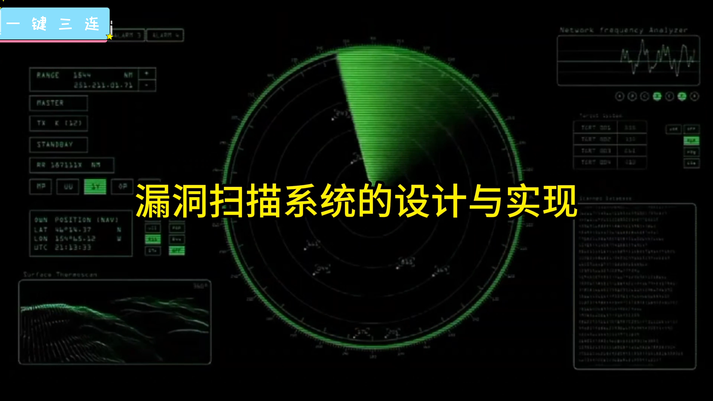
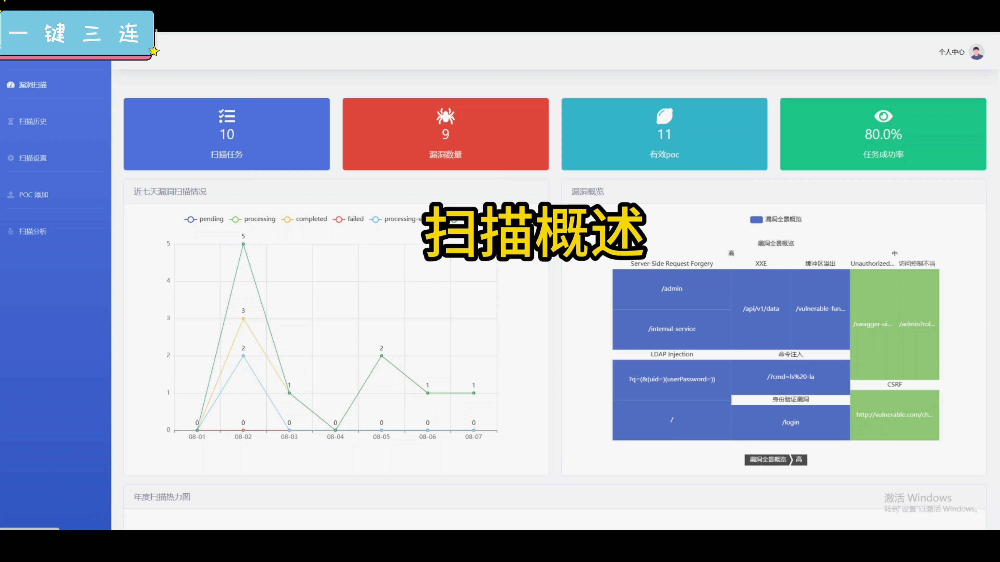
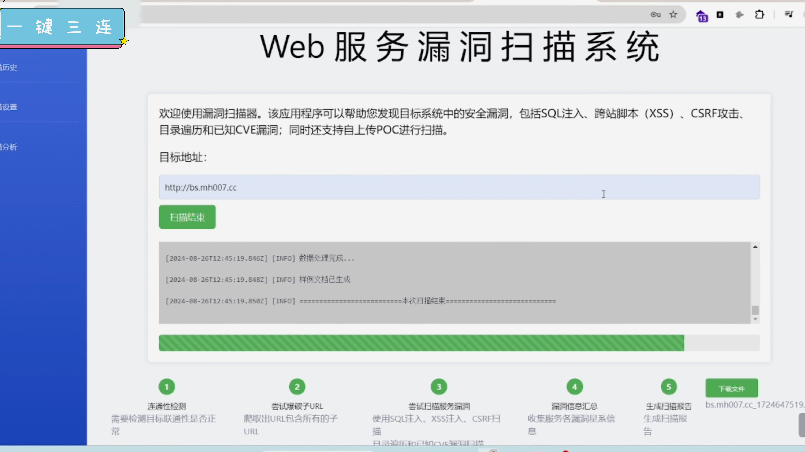
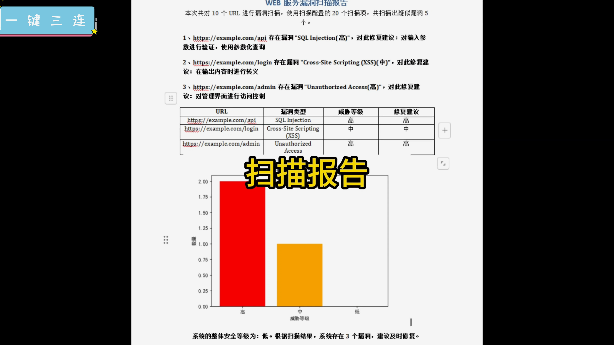
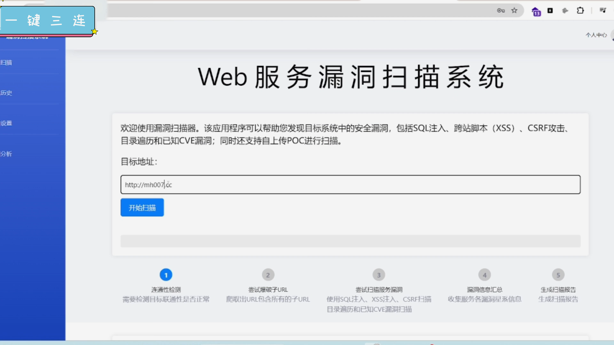
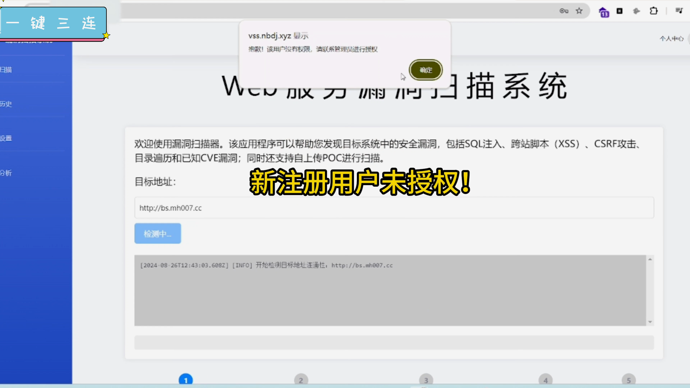
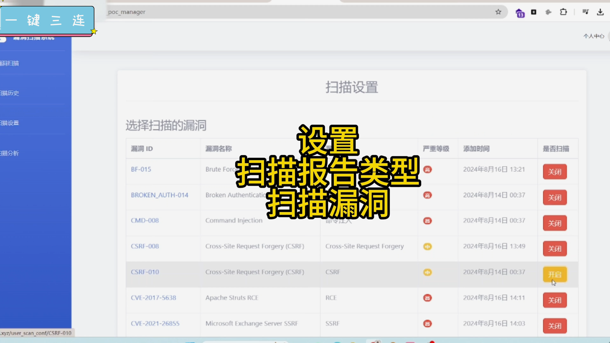
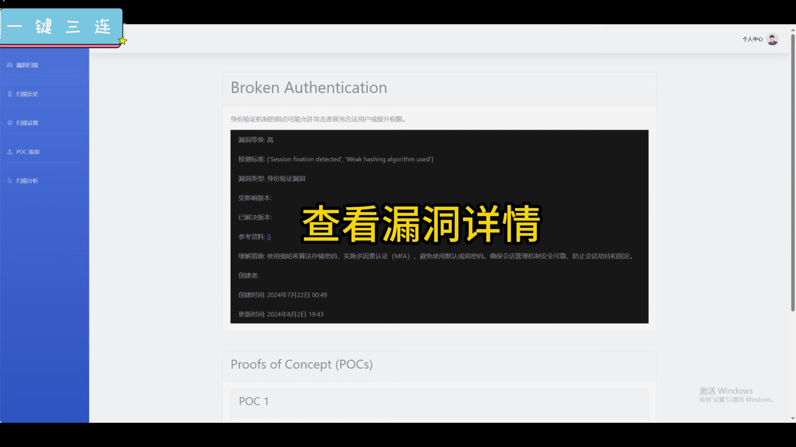
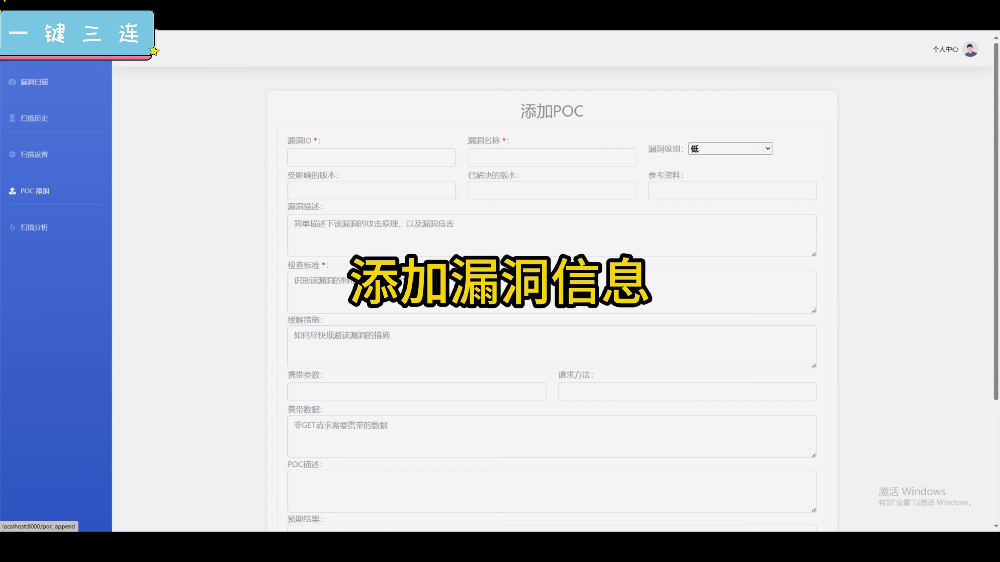
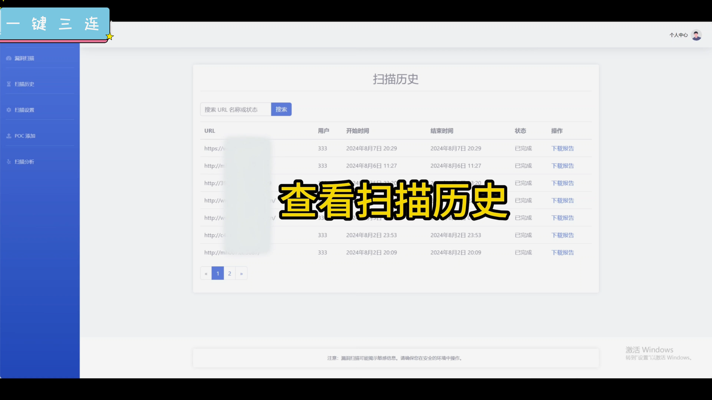

## 计算机毕业设计Python+大模型Web漏洞扫描系统 网络安全 信息安全 机器学习 深度学习 大数据毕业设计 数据可视化 Python毕业设计 Python爬虫

## 要求
### 源码有偿！一套(论文 PPT 源码+sql脚本+教程)

### 
### 加好友前帮忙start一下，并备注github有偿web漏洞扫描
### 我的QQ号是2827724252或者798059319或者 1679232425或者微信:bysj2023nb

# 

### 加qq好友说明（被部分 网友整得心力交瘁）：
    1.加好友务必按照格式备注
    2.避免浪费各自的时间！
    3.当“客服”不容易，repo 主是体面人，不爆粗，性格好，文明人。
## 介绍
1.多线程漏洞扫描，确保扫描高效性
2.扫描历史:可查看扫描历史任务并下载报告(pdf和word)
3.扫描配置:设置需要使用的漏洞类型，以及可以自定义添加漏洞，增加系统可扩展性
4.扫描概述:对整体扫描任务进行可视化分析，直观展示了漏洞分布情况

本项目旨在设计和实现一个基础的漏洞扫描系统，能够识别常见的安全漏洞，并对其进行分类与报告。通过这一设计，可以掌握网络安全的核心技术，同时提升编程能力和系统设计能力。
选择漏洞扫描系统作为毕业设计项目，具有多重优势。首先，漏洞扫描系统涉及的技术面广，包括网络协议、系统安全、数据处理和自动化控制等多方面内容，可以锻炼你的综合能力。其次，随着网络攻击的日益频繁，漏洞扫描技术在现实中有广泛应用，对未来的就业也有直接帮助。因此，这个项目不仅具备学术价值，更有实践意义。

## 演示视频
https://www.bilibili.com/video/BV1EG1GYpEYQ

https://www.bilibili.com/video/BV1zG1GYpEpz

## 运行截图

